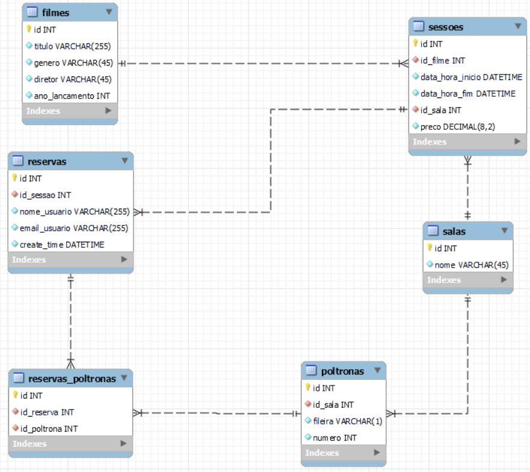

  <h1>CineBot - Desenvolvimento de um chatbot utilizando o Amazon Lex V2</h1>

  
Equipe 1

  | Nome                                 | Linkedin                                                                                 |
  | ---------------                      | -------------------------------------------------------------------                      |
  | Cristofer Gaier Sais                 | [Link](https://www.linkedin.com/in/cristofer-sais-a293591a0)                             |
  | João Victor Winderfeld Bussolotto    | [Link](https://www.linkedin.com/in/jo%C3%A3o-victor-winderfeld-bussolotto-aaa914145/)    |
  | Josué Mendonça                       | [Link](https://www.linkedin.com/in/josu%C3%A9-mendon%C3%A7a-dev77/)                      |    
  | Luiz Paulo Grafetti Terres           | [Link](https://www.linkedin.com/in/luiz-paulo-grafetti-terres-aa577a274/)                |      

***

## 📖 Sumário
- [1 - Objetivo](#ancora1)
  - [1.1 - Tecnologias Utilizadas](#ancora1-1)
- [2 - Desenvolvimento do Projeto](#ancora2)
  - [2.1 - Desenvolvimento da Base de Dados](#ancora2-1)
  - [2.2 - Desenvolvimento das APIs](#ancora2-2)
  - [2.3 - Desenvolvimento do Chatbot com Amazon Lex V2](#ancora2-3)
  - [2.4 - Desenvolvimento das Funções Lambda para Integração com o Chatbot](#ancora2-4)
- [3 - Acesso à Aplicação e Como Utilizá-la](#ancora3)
- [4 - Estrutura de Pastas do Projeto](#ancora4)
- [5 - Arquitetura AWS](#ancora5)
- [6 - Dificuldades conhecidas](#ancora6)
- [7 - Licença](#ancora7)

***

# 1 - Objetivo

O objetivo principal desta sprint era desenvolver um chatbot utilizando o Amazon Lex V2 e conectá-lo a uma plataforma de mensageria, neste caso, o `Slack`. A equipe se propôs a criar um chatbot chamado `CineBot`, capaz de interagir com clientes de um cinema e mostrar os filmes em cartaz, sessões disponíveis, reservar ingressos e cancelar reservas. O `CineBot` foi projetado para interpretar as intenções dos usuários e, em seguida, invocar funções implementadas no AWS Lambda para atender a essas intenções.
***

- ## 1.1 - Tecnologias Utilizadas

  

    
    
    
    
    
    
    
    
        

  

***

# 2 - Desenvolvimento do Projeto

- ## 2.1 - Desenvolvimento da Base de Dados
  A construção do banco de dados MySQL utilizando o `Amazon RDS` foi essencial para o nosso projeto. A tabela "filmes" está relacionada com a tabela "sessoes", permitindo que cada sessão seja associada a um filme específico. A tabela "sessoes" também está relacionada com a tabela "salas", o que permite identificar a sala onde uma sessão ocorrerá. Além disso, as tabelas "reservas" e "poltronas" estão relacionadas através da tabela intermediária "reservas_poltronas" garantindo que cada reserva possa incluir várias poltronas. 

  

    
  

- ## 2.2 - Desenvolvimento das APIs
  Desenvolvemos APIs utilizando o framework `Serverless`, que foram implantadas como funções Lambdas na AWS e integradas ao `Amazon API Gateway`. Essas APIs desempenham um papel fundamental na relação entre o Banco de Dados MySQL disponibilizado pelo `Amazon RDS` e o `CineBot`. Elas permitem consultas sobre filmes em cartaz, disponibilidade de sessões, reserva de ingressos e cancelamento de reservas, possibilitando uma grande experiência aos usuários ao interagirem com o `CineBot`.

- ## 2.3 - Desenvolvimento do Chatbot com Amazon Lex V2

- ## 2.4 - Desenvolvimento das Funções Lambda para Integração com o Chatbot

 
***

# 3 - Acesso à Aplicação e Como Utilizá-la 

### **[Link](https://join.slack.com/t/cinebot/shared_invite/zt-230mdlfty-ZnXD1152TADTj6EGxtvNQg)**

Para utilizar o `CineBot` no `Slack`, basta iniciar uma conversa com ele e selecionar uma das intents disponíveis: "Consultar Filmes" para obter informações sobre filmes em exibição, "Reservar Ingressos" para fazer uma reserva, "Sessões Disponíveis" para consultar as sessões disponíveis ou "Cancelar Reserva" para cancelar uma reserva existente. O `CineBot` guiará você através de diálogos e menu interativo, fornecendo respostas rápidas e informações relevantes para facilitar a sua experiência.

# 4 - Estrutura de Pastas do Projeto

- **bot-backend**
  - **controllers**
    - `movie_controller.py`
    - `reservation_controller.py`
    - `session_controller.py`
  - **core**
    - `config.py`
    - `database.py`
  - **models**
    - `__all_models.py`
    - `Base.py`
    - `Movie.py`
    - `Reservation.py`
    - `ReservationSeat.py`
    - `Room.py`
    - `Seat.py`
    - `Session.py`
  - **services**
    - `movie_service.py`
    - `reservation_service.py`
    - `session_service.py`
  - `.env`
  - `requirements.txt`
  - `serverless.yml`
  - `utils.py`

- **bot-lex-v2**
  - `.env`
  - `config.py`
  - `handleReservation.py`
  - `requirements.txt`
  - `router.py`
  - `serverless.yml`
  - `session.py`  
  - `showMovies.py`  
  - `utils.py`

***

# 5 - Arquitetura AWS

- ## Banco de Dados: 

  

    
  

- ## APIs: 

  

    
  

- ## CineBot: 

  

    
  

- ## Funções Lambda CineBot: 

  

    
  

***

# 6 - Dificuldades conhecidas

1. Deploy das funções lambdas com bibliotecas externas.
2. Desenvolvimento da lógica de negócio em relação ao tempo.

# 7 - Licença

Este projeto está licenciado sob a Licença MIT - consulte o [Link](https://mit-license.org/) para obter mais detalhes.