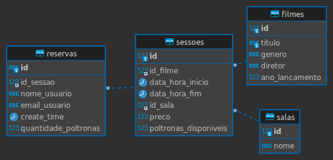
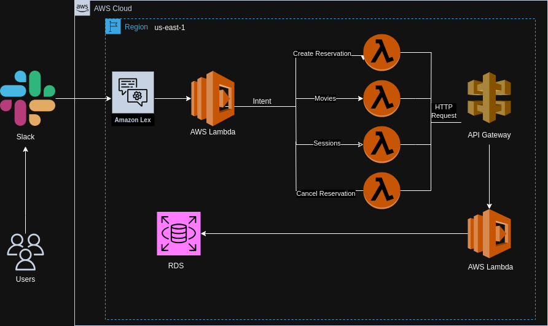

<div align="center">
  <h1>CineBot - Desenvolvimento de um chatbot utilizando o Amazon Lex V2</h1>
</div>

<div align="center">
  <p>Equipe 1</p>

  | Nome                                 | Linkedin                                                                                 |
  | ---------------                      | -------------------------------------------------------------------                      |
  | Cristofer Gaier Sais                 | [Link](https://www.linkedin.com/in/cristofer-sais-a293591a0)                             |
  | João Victor Winderfeld Bussolotto    | [Link](https://www.linkedin.com/in/jo%C3%A3o-victor-winderfeld-bussolotto-aaa914145/)    |
  | Josué Mendonça                       | [Link](https://www.linkedin.com/in/josu%C3%A9-mendon%C3%A7a-dev77/)                      |    
  | Luiz Paulo Grafetti Terres           | [Link](https://www.linkedin.com/in/luiz-paulo-grafetti-terres-aa577a274/)                |      


</div>

***

<a name="ancora"></a>
## 📖 Sumário
- [1 - Objetivo](#ancora1)
  - [1.1 - Tecnologias Utilizadas](#ancora1-1)
- [2 - Desenvolvimento do Projeto](#ancora2)
  - [2.1 - Desenvolvimento da Base de Dados](#ancora2-1)
  - [2.2 - Desenvolvimento das APIs](#ancora2-2)
  - [2.3 - Desenvolvimento do Chatbot com Amazon Lex V2](#ancora2-3)
  - [2.4 - Desenvolvimento das Funções Lambda para Integração com o Chatbot](#ancora2-4)
- [3 - Acesso à Aplicação e Como Utilizá-la](#ancora3)
- [4 - Estrutura de Pastas do Projeto](#ancora4)
- [5 - Arquitetura AWS](#ancora5)
- [6 - Dificuldades conhecidas](#ancora6)
- [7 - Licença](#ancora7)

***
<a id="ancora1"></a>
# 1 - Objetivo

O objetivo principal desta sprint era desenvolver um chatbot utilizando o Amazon Lex V2 e conectá-lo a uma plataforma de mensageria, neste caso, o `Slack`. A equipe se propôs a criar um chatbot chamado `CineBot`, capaz de interagir com clientes de um cinema e mostrar os filmes em cartaz, sessões disponíveis, reservar ingressos e cancelar reservas. O `CineBot` foi projetado para interpretar as intenções dos usuários e, em seguida, invocar funções implementadas no AWS Lambda para atender a essas intenções.
***

<a id="ancora1-1"></a>
- ## 1.1 - Tecnologias Utilizadas

  <div style="display: inline-block" align="center">
    
    
    
    
    
    
    
    
        


  </div>

***
<a id="ancora2"></a>

# 2 - Desenvolvimento do Projeto

<a id="ancora2-1"></a>

- ## 2.1 - Desenvolvimento da Base de Dados
  A construção do banco de dados MySQL utilizando o `Amazon RDS` foi essencial para o nosso projeto. A tabela "filmes" está relacionada com a tabela "sessoes", permitindo que cada sessão seja associada a um filme específico. A tabela "sessoes" também está relacionada com a tabela "salas", o que permite identificar a sala onde uma sessão ocorrerá. Além disso, as tabelas "reservas" e "sessoes" estão relacionadas garantindo que cada reserva armazene o número de poltronas reservadas para cada sessão. 

  <div align="center">
    
  </div>

<a id="ancora2-2"></a>

- ## 2.2 - Desenvolvimento das APIs
  Desenvolvemos APIs utilizando o framework `Serverless`, que foram implantadas como funções Lambdas na AWS e integradas ao `Amazon API Gateway`. Essas APIs desempenham um papel fundamental na relação entre o Banco de Dados MySQL disponibilizado pelo `Amazon RDS` e o `CineBot`. Elas permitem consultas sobre filmes em cartaz, disponibilidade de sessões, reserva de ingressos e cancelamento de reservas, possibilitando uma grande experiência aos usuários ao interagirem com o `CineBot`.

<a id="ancora2-3"></a>

- ## 2.3 - Desenvolvimento do Chatbot com Amazon Lex V2
  Desenvolvemos o CineBot usando Amazon Lex V2 para criar uma experiência conversacional intuitiva. Criamos menus interativos com "response cards" para o usuário navegar para cada intenção do chatbot, permitindo que os usuários escolham ações, como pesquisar filmes ou fazer reservas. Cada intenção está vinculada a uma função Lambda que processa as solicitações dos usuários e fornece respostas relevantes.


<a id="ancora2-4"></a>

- ## 2.4 - Desenvolvimento das Funções Lambda para Integração com o Chatbot
  Nossas funções Lambda foram escritas em `Python` implantadas usando o framework `Serverless`. Elas lidam com solicitações específicas do chatbot, como reservas de ingressos e consultas sobre filmes, garantindo eficiência e escalabilidade. Isso permite ao CineBot oferecer uma experiência de usuário contínua e confiável.
 
***

<a id="ancora3"></a>

# 3 - Acesso à Aplicação e Como Utilizá-la 

### **[Link](https://join.slack.com/t/cinebot/shared_invite/zt-230mdlfty-ZnXD1152TADTj6EGxtvNQg)**

Para utilizar o `CineBot` no `Slack`, basta iniciar uma conversa com ele e selecionar uma das intents disponíveis: "Consultar Filmes" para obter informações sobre filmes em exibição, "Reservar Ingressos" para fazer uma reserva, "Sessões Disponíveis" para consultar as sessões disponíveis ou "Cancelar Reserva" para cancelar uma reserva existente. O `CineBot` guiará você através de diálogos e menu interativo, fornecendo respostas rápidas e informações relevantes para facilitar a sua experiência.

<a id="ancora4"></a>

# 4 - Estrutura de Pastas do Projeto

```
.
├── README.md
├── bot-backend
│   ├── controllers
│   │   ├── movie_controller.py
│   │   ├── reservation_controller.py
│   │   └── session_controller.py
│   ├── models
│   │   ├── Base.py
│   │   ├── Movie.py
│   │   ├── Reservation.py
│   │   ├── Room.py
│   │   ├── Session.py
│   │   └── __all_models.py
│   ├── services
│   │   ├── email_service.py
│   │   ├── movie_service.py
│   │   ├── reservation_service.py
│   │   └── session_service.py
│   ├── core
│   │   ├── config.py
│   │   └── database.py
│   ├── static
│   │   └── reservation_email_template.html
│   ├── requirements.txt
│   ├── serverless.yaml
│   └── utils.py 
└── bot-lex-v2
    ├── config.py
    ├── handleReservation.py
    ├── handleSession.py
    ├── requirements.txt
    ├── router.py
    ├── serverless.yml
    ├── showMovies.py
    └── utils.py
```

***

<a id="ancora5"></a>

# 5 - Arquitetura AWS

  <div align="center">
    
  </div>


***

<a id="ancora6"></a>
# 6 - Dificuldades conhecidas

1. Deploy das funções lambdas com bibliotecas externas.
2. Desenvolvimento da lógica de negócio em relação ao tempo.
3. Definição final da modelagem do banco de dados.


<a id="ancora7"></a>
# 7 - Licença

Este projeto está licenciado sob a Licença MIT - consulte o [Link](https://mit-license.org/) para obter mais detalhes.